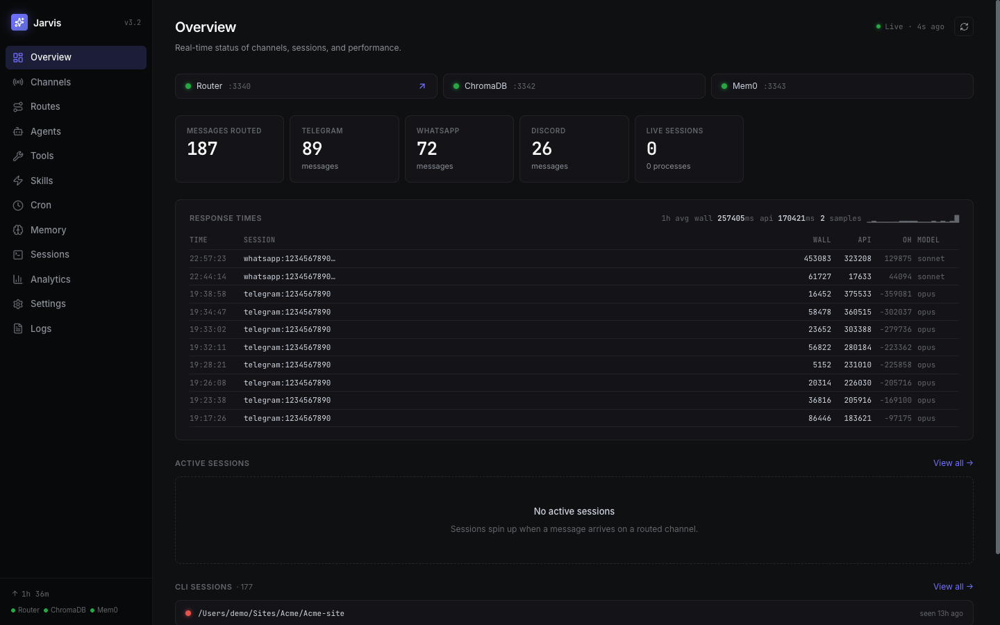
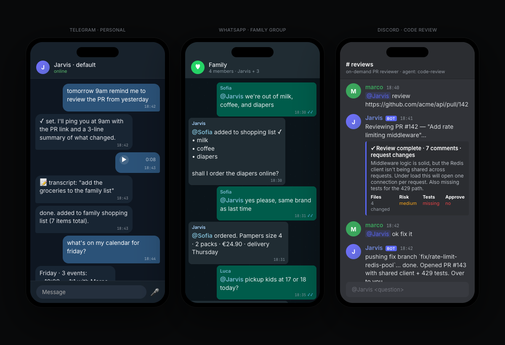
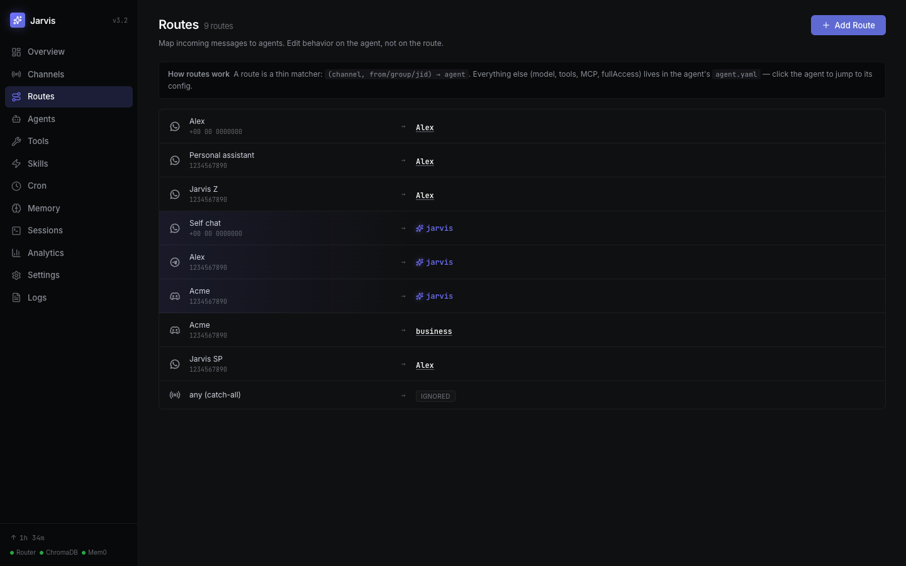
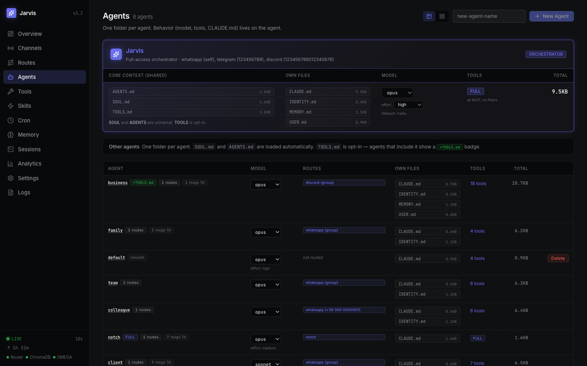
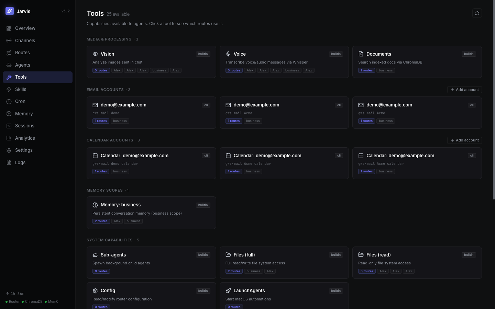
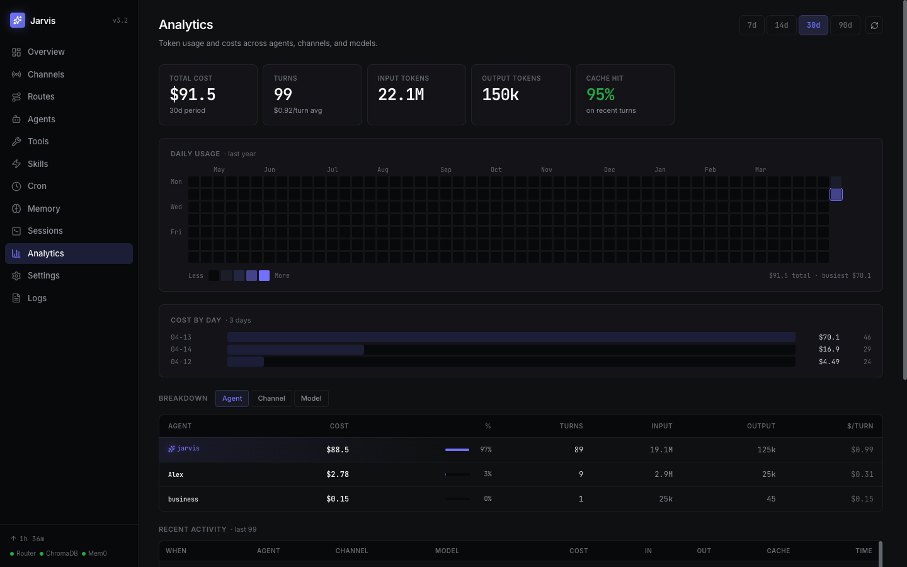
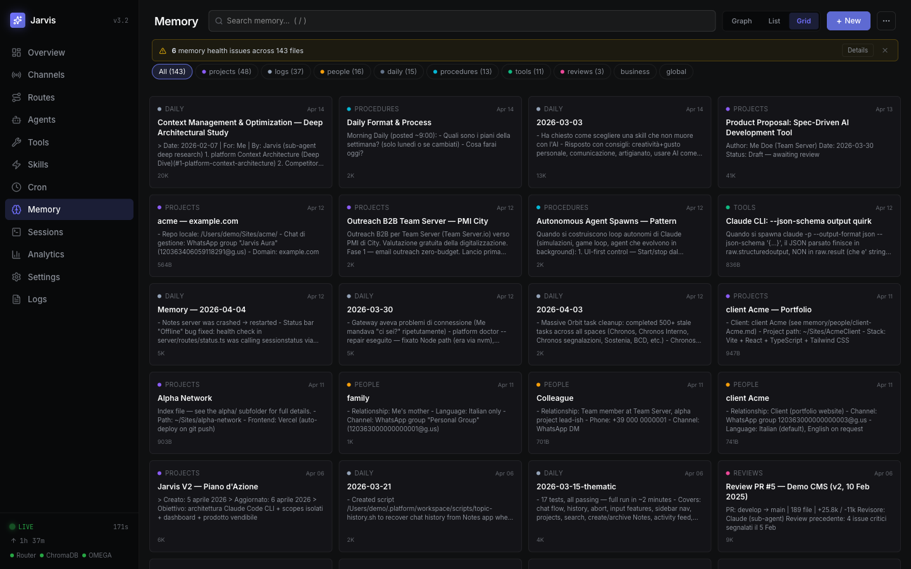
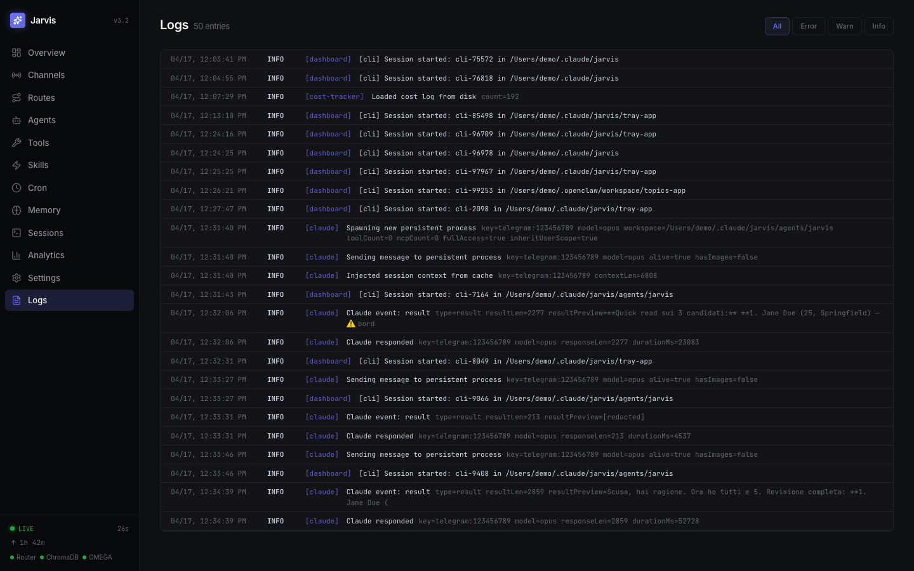
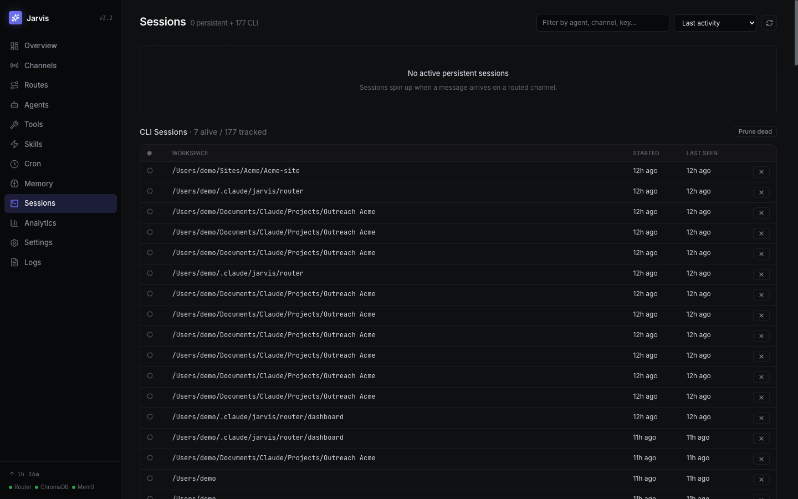

# Jarvis Claude Code

<sub>`jarvis-claudecode` · zorahrel/jarvis-claudecode</sub>

> Multi-channel router that brings the **Claude Code CLI** to Telegram, WhatsApp, and Discord — with per-route agents, persistent memory, media processing, a web dashboard, and a native macOS tray app.



<p align="left">
  
  
  
  
  
</p>

Jarvis Claude Code is a personal AI gateway. Messages arriving on any chat platform are matched against per-route agents — each with its own identity (`CLAUDE.md`), tool scope, memory, and model. A persistent Claude Code process runs per session key, so conversations retain context across messages.

**Keywords**: Claude Code, Claude Code CLI, Telegram bot, WhatsApp bot, Discord bot, MCP, ChromaDB, OMEGA, multi-channel AI assistant, personal AI agent, macOS menu bar.

---

## Table of Contents

- [Why Jarvis Claude Code](#why-jarvis-claude-code)
- [Use Cases](#use-cases)
- [Features](#features)
- [Architecture at a Glance](#architecture-at-a-glance)
- [Requirements](#requirements)
- [Quick Start](#quick-start)
- [Configuration](#configuration)
- [How it Compares](#how-it-compares)
- [Project Layout](#project-layout)
- [Documentation](#documentation)
- [Roadmap](#roadmap)
- [Contributing](#contributing)
- [License](#license)

## Why Jarvis Claude Code

The Claude Code CLI is powerful on the desktop — but chat apps are where most real-world requests happen. Jarvis Claude Code exposes that same CLI through the messaging channels you already use, while keeping:

- **One agent per context** — personal DM, work group, and public channel can each run a different agent with different tools, memory, and permissions.
- **Real conversation memory** — ChromaDB indexes your notes, OMEGA extracts and indexes facts from conversation history.
- **Media-in, media-out** — voice notes get transcribed, images go to vision, PDFs become text, and Claude's file edits come back as attachments.
- **Native and local** — no Docker, no cloud router. Services run under the platform's native service manager (`launchd` on macOS, `systemd --user` on Linux, Task Scheduler on Windows). On macOS they're also controllable from a SwiftUI tray app.
- **Uses your Claude subscription, not API keys** — because the backend is the Claude Code CLI (OAuth-authenticated against your Max / Pro / Team plan), you pay zero per-token costs for the agents. Everything else is local: ChromaDB document memory runs on-device, OMEGA conversation memory runs on-device, Whisper transcription runs on-device. The router needs no external API key at all. This makes it a compelling alternative to router projects like [OpenClaw][o] that run on metered provider API keys.

## Use Cases

Jarvis Claude Code started as a personal assistant, but one router can host an arbitrary number of specialized agents — each with its own identity, tools, and chat audience. A few patterns that work well:

- **Personal productivity hub** — one agent in your Telegram DM with full memory, calendar, email, and file access. Voice a task while walking and get a reply with the output file attached.
- **Family agents** — a dedicated agent per family member (or a shared family-group agent), each with their own `agents/<name>/CLAUDE.md` personality and scoped memory. Kids get a read-only agent, parents get a full-access one.
- **Direct client channel on WhatsApp** — give clients a WhatsApp number that routes to a scoped agent with read-only access to their project folder. They chat in natural language, the agent answers from project context; you review the logs in the dashboard.
- **Team coordination** — a Telegram or Discord group where an agent takes standup notes, answers repo questions from embedded docs, and pings you on Slack-style mentions. Per-route rate limits keep the noise down.
- **On-demand code review on Discord** — a `/review` agent in a dev Discord that reads a PR link, runs a focused review with its own MCP toolchain, and posts structured feedback back to the thread.
- **Always-on cron agents** — daily report at 9am, weekly digest on Friday evening, nightly backup verification — each cron is a fresh Claude Code session with a clean context window, delivering its output to the channel of your choice.
- **Customer support triage** — route unknown WhatsApp senders to a pairing flow, then to a tier-1 triage agent that either resolves or escalates by DMing you.

Because each route maps to an agent folder (`agents/<name>/`) and each agent declares its own tool list, MCP servers, model, and CLAUDE.md, adding a new use case is typically a 5-minute copy-and-edit of the `default` template.



> Left to right: a personal Telegram agent handling voice notes and calendar, a shared family WhatsApp agent managing shopping and childcare, and an on-demand code-review agent on Discord. All three use the same router — only the `agents/<name>/` folder differs.

## Features

- **Channels**: Telegram, WhatsApp (via Baileys), Discord
- **Per-route agents**: each agent lives in `agents/<name>/` with its own `agent.yaml` + `CLAUDE.md`
- **Media pipeline**: voice → Whisper, images → Claude vision, PDFs/docs → text, quoted replies as context
- **Memory**: ChromaDB (document RAG) + OMEGA (conversation fact extraction)
- **Dashboard**: React SPA at `http://localhost:3340` — routes, agents, tools, memory, costs, logs
- **macOS tray app**: SwiftUI menu bar app to start/stop/restart services
- **Config-driven services**: add extra services to `config.yaml` and they show up in the dashboard and tray
- **Native service managers**: no Docker, no pm2 — services run under `launchd` (macOS), `systemd --user` (Linux), or Task Scheduler (Windows), registered automatically by `setup.sh` / `setup.ps1`
- **Spawn discipline**: `--strict-mcp-config`, per-route tool filtering, readonly file access, user-scope inheritance toggle
- **No external API keys required**: ChromaDB and OMEGA run locally with ONNX embeddings; Claude Code CLI is OAuth-authenticated against your subscription

### Dashboard tour

| | |
|---|---|
|  |  |
| **Routes** — one row per `(channel, match) → agent` mapping. Evaluated top-down, first match wins. | **Agents** — each agent is a folder with its own `CLAUDE.md`, tool list, memory scope, and model. |
|  |  |
| **Tools** — per-capability view across vision, voice, docs, email accounts, calendar, memory, system, and MCP. | **Analytics** — token usage and cost over time, broken down by agent / channel / model. |
|  |  |
| **Memory** — ChromaDB docs and OMEGA conversation facts scoped per agent, browsable as grid / list / graph. | **Logs** — structured log stream with level filtering, search, and auto-scroll. |
|  | |
| **Sessions** — active and past Claude Code CLI sessions, one per `(channel, from)` key, killable from the UI. | |

## Architecture at a Glance

```
┌──────────────────────────────────────────────────────────────┐
│                    Messaging Channels                        │
│        Telegram   │   WhatsApp   │   Discord                 │
└──────┬───────────────────┬──────────────────┬────────────────┘
       │                   │                  │
       ▼                   ▼                  ▼
┌──────────────────────────────────────────────────────────────┐
│                      Router (:3340/:3341)                    │
│   Route matching  →  Media pipeline  →  Spawn discipline     │
└──────┬────────────────────────────┬────────────────┬─────────┘
       │                            │                │
       ▼                            ▼                ▼
┌───────────────┐        ┌───────────────┐   ┌───────────────┐
│ Claude Code   │        │  ChromaDB     │   │   OMEGA       │
│ CLI processes │        │  (:3342)      │   │   (:3343)     │
│ (1 per key)   │        │  Doc RAG      │   │   Conv. facts │
└───────────────┘        └───────────────┘   └───────────────┘
       │
       ▼
┌──────────────────────────────────────────────────────────────┐
│           agents/<name>/   — identity, tools, MCP            │
└──────────────────────────────────────────────────────────────┘
```

Full design: [`ARCHITECTURE.md`](ARCHITECTURE.md).

## Requirements

- **OS**: macOS 13+, Linux (systemd), or Windows 10/11. The SwiftUI tray app is macOS-only; the router, dashboard, and memory services are fully cross-platform.
- Node.js 20+ and `tsx`
- Python 3.11+ (for the ChromaDB and OMEGA servers)
- [Claude Code CLI](https://docs.claude.com/en/docs/claude-code)
- `ffmpeg`, `whisper-cli` (whisper.cpp), `pdftotext` for media processing (optional — media pipeline features that need them are auto-disabled if missing)

**No required external keys**. Both memory layers run entirely on-device: ChromaDB indexes Markdown documents with `all-MiniLM-L6-v2` ONNX, OMEGA stores conversation memory in SQLite + `sqlite-vec` + FTS5 with `bge-small-en-v1.5` ONNX. The only keys the router needs are your channel bot tokens (Telegram, Discord).

## Quick Start

```bash
# 1. Clone
git clone https://github.com/zorahrel/jarvis-claudecode.git ~/.claude/jarvis
cd ~/.claude/jarvis

# 2. One-shot setup. Installs deps, builds the dashboard, downloads the ONNX
#    model, scaffolds .env / config.yaml / agents/default, and registers
#    the three services (ChromaDB, OMEGA, router) with the platform's service
#    manager so they auto-start at login. Idempotent — safe to re-run.
#
#    macOS / Linux:
./setup.sh
#    Windows (PowerShell):
powershell -ExecutionPolicy Bypass -File .\setup.ps1

# 3. Fill in tokens and routes
#    router/.env         → TELEGRAM_BOT_TOKEN, DISCORD_BOT_TOKEN
#    router/config.yaml  → phone / Telegram ID / Discord ID / routes
#    agents/default/     → CLAUDE.md + agent.yaml

# 4. Restart the router so it picks up your tokens (services already run)
#    macOS:   launchctl kickstart -k gui/$(id -u)/com.jarvis.router
#    Linux:   systemctl --user restart jarvis-router
#    Windows: Stop-ScheduledTask -TaskName JarvisRouter; Start-ScheduledTask -TaskName JarvisRouter
```

Dashboard: <http://localhost:3340>. Logs: `~/.claude/jarvis/logs/`.

### Platform coverage

| Platform | Service manager | Units installed |
|----------|-----------------|-----------------|
| macOS    | `launchd` (LaunchAgents) | `com.jarvis.chroma`, `com.jarvis.omega`, `com.jarvis.router` |
| Linux    | `systemd --user` | `jarvis-chroma.service`, `jarvis-omega.service`, `jarvis-router.service` |
| Windows  | Task Scheduler (hidden, at-logon) | `JarvisChroma`, `JarvisOmega`, `JarvisRouter` |

Pass `--no-agents` (bash) or `-NoAgents` (PowerShell) to skip the service
registration step if you want to run the stack manually.

> On Linux, run `loginctl enable-linger $USER` once so the services keep
> running after you log out. The SwiftUI tray app only builds on macOS.

## Configuration

Two files and one folder are all you touch:

| Where | What |
|------|---------|
| `router/.env` | Bot tokens (`TELEGRAM_BOT_TOKEN`, `DISCORD_BOT_TOKEN`). Never commit. |
| `router/config.yaml` | Channels, routes, rate limits, crons, extra services. |
| `agents/<name>/` | One folder per agent — `agent.yaml` (model, tools, MCP) + `CLAUDE.md` (identity). |

### Anatomy of `config.yaml`

The full annotated version is [`router/config.example.yaml`](router/config.example.yaml). Here is the shape:

```yaml
jarvis:
  allowedCallers: ["+391234567890"]     # phones that can @jarvis in WA groups

channels:
  telegram: { enabled: true, botToken: $TELEGRAM_BOT_TOKEN }
  whatsapp: { enabled: true, authDir: ./wa-auth }
  discord:  { enabled: true, botToken: $DISCORD_BOT_TOKEN }

routes:                                  # top-down, first match wins
  - match: { channel: telegram, from: 123456789 }           # your TG user ID
    use: default                                            # → agents/default/
  - match: { channel: whatsapp, group: "120363...@g.us" }
    use: family
  - match: { channel: discord, guild: "987654321098765432" }
    use: code-review
  - match: { channel: "*" }                                 # catch-all
    action: ignore

crons:
  - name: morning-brief
    schedule: "0 8 * * *"
    timezone: Europe/Rome
    workspace: ./agents/default
    prompt: "Summarize today's calendar and top 3 unread emails."
    delivery: { channel: telegram, target: "123456789" }
```

Each agent folder declares **what** the agent is (model, tools, memory scope, MCP servers) — routes only say **who** talks to **which** agent on **which** channel.

### Customize Jarvis without reading all the docs

The repo ships a Claude Code skill, **`jarvis-config`**, that edits `config.yaml`, scaffolds agents, and wires channels for you. `./setup.sh` installs it via the Jarvis skills marketplace at `~/jarvis/skills-marketplace/`, which Claude Code loads automatically in every session (CLI, router-spawned agents, and any remote channel). Then:

```
/jarvis-config add a Telegram route for my phone to agent "family"
/jarvis-config create a new agent "code-review" with readonly access and brave-search
/jarvis-config schedule a daily 9am digest to my Telegram
```

Skill source: [`skills/jarvis-config/SKILL.md`](skills/jarvis-config/SKILL.md).

Custom skills added by Jarvis agents (from Telegram/WhatsApp/Discord) also land in the marketplace and are available in the next session. Existing users on the pre-1.1 layout can migrate with `bash scripts/migrate-to-marketplace.sh`.

### Extra services

Register any background service in the dashboard ribbon and tray app by listing it under `services:` in `config.yaml`:

```yaml
services:
  - name: MyService
    port: 3335
    healthUrl: http://localhost:3335/health
    linkUrl: http://localhost:3335       # optional
    launchd:                              # optional — enables tray management
      label: com.example.myservice
      args:
        - node
        - ~/path/to/app.js
      cwd: ~/path/to
```

## How it Compares

There are a few excellent projects in the "Claude Code as a bot backend" space. Here is how Jarvis Claude Code positions itself against them, so you can pick the right tool for your use case:

| | **Jarvis Claude Code** | [sbusso/claudeclaw][s] | [openclaw/openclaw][o] | [moazbuilds/claudeclaw][m] |
|---|---|---|---|---|
| **Agent engine** | Claude Code CLI spawn | Claude Agent SDK (`query()`) | Pi runtime (proprietary) | Claude Code CLI spawn (Bun) |
| **Models** | Claude only | Claude only | Multi-provider | Claude only |
| **Channels** | Telegram, WhatsApp, Discord | Telegram, WhatsApp, Slack | 23+ channels | Telegram, Discord |
| **Runtime** | Node.js + tsx | Node.js | Node.js (pnpm) | Bun |
| **Memory** | ChromaDB + OMEGA | Filesystem + grep | SQLite + FTS5 + sqlite-vec | Claude sessions + CLAUDE.md |
| **Isolation** | `--strict-mcp-config` + per-route tool deny list | `@anthropic-ai/sandbox-runtime` (kernel) | Docker containers | `--dangerously-skip-permissions` |
| **Config** | YAML | SQLite + `.env` | Typed config (zod) + wizard | JSON settings |
| **Dashboard** | React SPA + macOS tray | — (TUI on roadmap) | Control UI + macOS menu bar | Local web UI |
| **Cost tracking** | No (planned) | Per-run in SQLite | Per-session + OTEL | No |
| **Plugin system** | MCP per-route | `registerExtension()` | ClawHub + SDK | Claude Code plugin marketplace |

[s]: https://github.com/sbusso/claudeclaw
[o]: https://github.com/openclaw/openclaw
[m]: https://github.com/moazbuilds/claudeclaw

### What Jarvis Claude Code does differently

**Pros**

- **Subscription-powered, not API-metered** — because the backend is the Claude Code CLI authenticated via OAuth, agents run on your Claude Max / Pro / Team subscription at flat cost. Alternatives that use the Anthropic API or multi-provider routers (OpenClaw) bill per token — at heavy use that is an order of magnitude more expensive.
- **Claude Code CLI, not Agent SDK** — keeps the full ecosystem: skills, hooks, slash commands, sub-agents, MCP, settings layering. Agent SDK wrappers re-implement a subset of that.
- **Two-layer identity that survives `--resume`** — `~/.claude/CLAUDE.md` (user global) + `<workspace>/CLAUDE.md` (agent). No fragile `--append-system-prompt` hacks.
- **Per-route scoping with real enforcement** — `--strict-mcp-config` + `--disallowed-tools` + `fileAccess: readonly` gate actions at spawn time, per chat context.
- **Hybrid memory out of the box** — document RAG (ChromaDB) and conversation fact extraction (OMEGA) as first-class services, both fully local, auto-managed by launchd.
- **End-to-end media pipeline** — voice → Whisper, images → Claude vision content blocks, PDFs → text, quoted replies kept as context, file outputs auto-sent back as attachments.
- **Native service-manager integration** — `launchd` / `systemd --user` / Task Scheduler units are registered automatically by the setup script, with restart-on-failure. On macOS there's also a SwiftUI tray app for start/stop/health. No Docker daemon required.

**Cons (today)**

- **No process-level sandbox** — isolation is at the CLI-argument level, not kernel-level like sbusso's sandbox-runtime or OpenClaw's Docker. A hardened sandbox mode is on the roadmap.
- **No built-in cost tracking** — `--output-format stream-json` usage logging is planned, not implemented.
- **Tray app is macOS-only** — the core router, dashboard, and autostart work on macOS, Linux, and Windows; the SwiftUI menu-bar app is macOS-exclusive.
- **Claude-only** — if you need OpenAI/Gemini/local models as peers, OpenClaw is a better fit.
- **Fewer channels than OpenClaw** — Telegram, WhatsApp, and Discord cover most personal use, but there's no Matrix/Signal/Slack out of the box.

Use Jarvis Claude Code if you want a personal, Claude-Code-native, config-driven router on your own Mac. Use the alternatives if you need kernel sandboxing, multi-provider model support, or 20+ channels.

## Project Layout

```
.
├── router/               # TypeScript router (entry point, channels, dashboard API)
│   ├── src/              # Router source
│   ├── dashboard/        # React SPA (Vite)
│   ├── scripts/          # ChromaDB + OMEGA Python servers
│   └── config.example.yaml
├── agents.example/       # Agent template — copy to agents/<name>/
├── tray-app/             # macOS SwiftUI menu bar app
├── ARCHITECTURE.md       # System design
├── SETUP.md              # Operations and troubleshooting
├── TODO.md               # Roadmap
├── CLAUDE.md             # Project instructions for Claude Code contributors
└── LICENSE
```

## Documentation

- [`ARCHITECTURE.md`](ARCHITECTURE.md) — full system overview, directory structure, design decisions
- [`SETUP.md`](SETUP.md) — operational commands, troubleshooting, service management
- [`TODO.md`](TODO.md) — current roadmap and known issues
- [`CLAUDE.md`](CLAUDE.md) — contributor guide for Claude Code itself

## Roadmap

See [`TODO.md`](TODO.md) for the full list. Highlights on deck:

- Sub-agents from chat — "do X in background" spawns a background Claude task
- Dashboard auth for exposure outside localhost/LAN
- Log rotation for service logs

## Responsible use

Jarvis Claude Code orchestrates the **Claude Code CLI**, which is a commercial product of Anthropic. Before running it:

- **Bring your own Claude subscription.** Jarvis spawns `claude` processes authenticated against whatever subscription (Max / Pro / Team) or API credentials are configured in your local Claude Code install. Usage is subject to Anthropic's [Usage Policy](https://www.anthropic.com/legal/aup) and the terms of your plan — including the "reasonable personal/professional use" expectations of consumer plans. If you plan to expose an agent to many external users, consider switching that agent to API-backed billing rather than sharing a personal subscription.
- **Disclose that your bot is AI.** If a Jarvis route serves anyone other than yourself — family, clients, a public Discord, a support channel — the agent should tell users, at least once per conversation, that they are talking to an AI assistant powered by Claude. Impersonating a human, or hiding the AI-in-the-loop, violates Anthropic's Usage Policy and most platform ToS. See `agents.example/default/CLAUDE.md` for the default rule.
- **Follow each channel's platform ToS.** Telegram and Discord officially support bots. WhatsApp does not: the Baileys integration is an unofficial WhatsApp Web client, and using it on your main number carries a non-zero risk of a Meta ban. For production or client-facing WhatsApp use, migrate to the official WhatsApp Business API.

None of this is legal advice — it's the same operational discipline the maintainer applies. When in doubt, read the upstream policy and ask a lawyer, not your chatbot.

## Contributing

This is a personal project, but ideas and patches are welcome. Please open an issue first for anything non-trivial so we can align on scope. Before submitting a PR:

- Run `npx tsc --noEmit` inside `router/` — there must be no new TypeScript errors
- Rebuild the dashboard if you touched it: `cd router/dashboard && npm run build`
- Keep code, commit messages, and docs in English — see `CLAUDE.md` for project conventions
- Never commit `router/.env`, `router/config.yaml`, `agents/*`, `memory/*`, `mem0-export-*.json`, or anything under `docs/migration/mem0-export-*.json` — they contain personal data and are gitignored by default

## License

[MIT](LICENSE)
